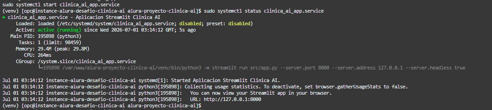
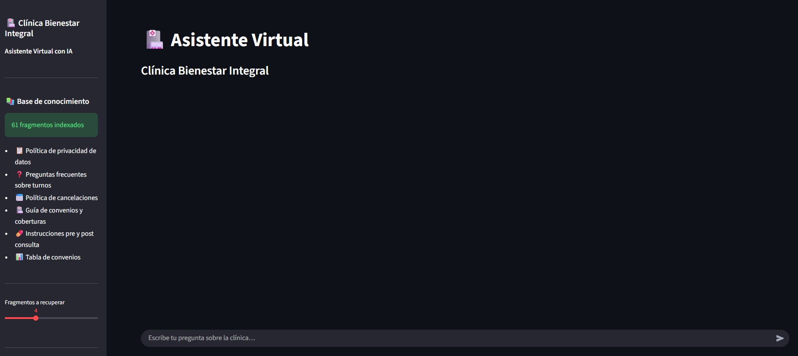
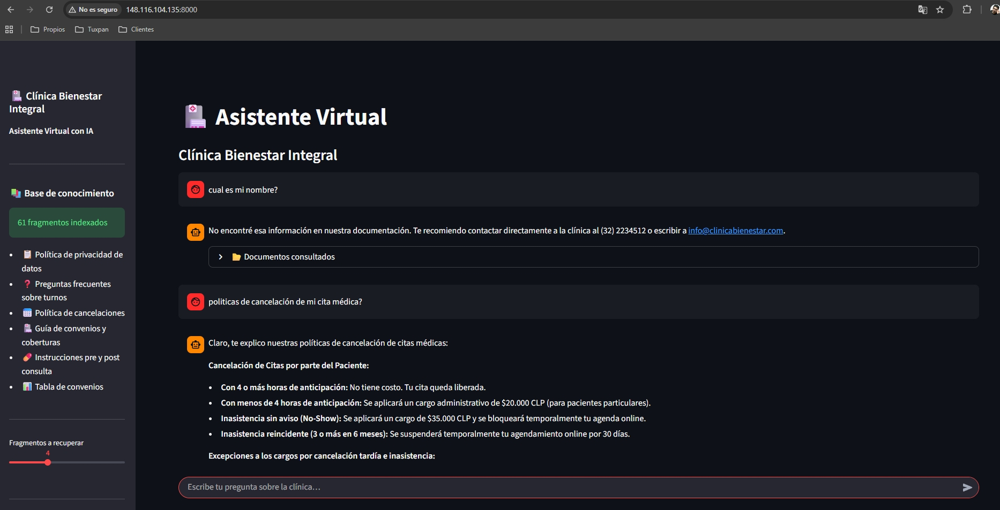

# Agente IA — Clínica Bienestar Integral

---

## Descripción general del proyecto

Este proyecto es un **asistente conversacional corporativo** desarrollado para la
Clínica Bienestar Integral. Permite que pacientes y colaboradores hagan preguntas
en lenguaje natural y reciban respuestas precisas basadas exclusivamente en los
documentos internos de la clínica.

El agente utiliza la técnica **RAG (Retrieval-Augmented Generation)**: en lugar de
depender solo del conocimiento del modelo de lenguaje, primero busca los fragmentos
más relevantes en los documentos de la clínica y luego genera la respuesta usando
ese contexto. Esto garantiza que la información entregada sea siempre fiel a las
políticas y procedimientos reales de la organización, sin inventar datos.

Los documentos indexados cubren:

| Documento | Categoría |
|---|---|
| Política de privacidad y protección de datos | Privacidad y Datos |
| Preguntas frecuentes sobre consultas y turnos | FAQ |
| Política de cancelaciones y reagendamiento | Políticas |
| Guía de convenios y coberturas médicas | Convenios y Coberturas |
| Instrucciones pre y post consulta médica | Instrucciones Médicas |
| Tabla de convenios EPS | Convenios y Coberturas |

---

## Arquitectura de la solución

El sistema opera en dos fases independientes:

### Fase 1 — Ingesta de documentos (se ejecuta una sola vez)

```
docs/
├── *.pdf            ──►  ingestion.py  ──►  fragmentos ~800 chars
└── convenios.csv          (chunking)         + metadatos
                                                    │
                                                    ▼
                                        Gemini gemini-embedding-001
                                           (vectoriza cada fragmento)
                                                    │
                                                    ▼
                                             ChromaDB
                                        (almacenamiento persistente
                                          en chroma_db/)
```

### Fase 2 — Conversación en tiempo real

```
Pregunta del usuario
        │
        ▼
Gemini gemini-embedding-001  →  vector de la pregunta
        │
        ▼
ChromaDB  →  recupera los fragmentos más similares semánticamente
        │
        ▼
Gemini gemini-2.0-flash  →  genera respuesta citando fuentes
        │
        ▼
Streamlit  →  muestra la respuesta y los documentos consultados
```

### Diagrama general

```
┌──────────────┐   pregunta    ┌──────────────────┐
│   Streamlit  │ ────────────► │    ChromaDB      │
│   (Chat UI)  │               │  (Vector Store)  │
│              │ ◄─ fragmentos─│                  │
│              │               └──────────────────┘
│              │  contexto +           ▲
│              │  pregunta     ┌───────┴──────┐
│              │ ────────────► │  Gemini API  │
│              │ ◄─ respuesta ─│  2.0 Flash   │
└──────────────┘               └──────────────┘
       ▲
  ingesta inicial
       │
┌──────┴─────────────────────┐
│  Pipeline de ingesta        │
│  PDF · CSV                  │
│  → chunking → embeddings    │
│  gemini-embedding-001       │
└─────────────────────────────┘
```

---

## Tecnologías y herramientas

| Categoría | Tecnología | Versión | Uso en el proyecto |
|---|---|---|---|
| Lenguaje | Python | 3.11+ | Backend completo |
| LLM | Google Gemini 2.5 Flash Lite | gemini-2.5-flash-lite | Generación de respuestas |
| Embeddings | Gemini Embedding | gemini-embedding-001 | Vectorización de texto |
| Vector store | ChromaDB | ≥ 0.5.0 | Almacenamiento y búsqueda semántica |
| Interfaz | Streamlit | ≥ 1.38.0 | Chat web interactivo |
| Lectura de PDFs | pypdf | ≥ 4.0.0 | Extracción de texto de PDFs |
| Variables de entorno | python-dotenv | ≥ 1.0.0 | Gestión segura de credenciales |
| Contenerización | Docker + Docker Compose | — | Empaquetado y despliegue |
| Nube | Oracle Cloud Infrastructure | — | Hosting en producción |
| SDK Google | google-genai | ≥ 0.3.0 | Cliente de embeddings |
| SDK Google | google-generativeai | ≥ 0.8.0 | Cliente de generación |

---

## Instrucciones para ejecutar el proyecto

### Opción A — Ejecución local

**Requisitos:** Python 3.11+ y una API Key de [Google AI Studio](https://aistudio.google.com/app/apikey).

```bash
# 1. Clonar el repositorio
git clone https://github.com/JFelipex3/alura-proyecto-clinica-ai.git
cd alura-proyecto-clinica-ai

# 2. Crear entorno virtual con Python 3.14.6
python -m venv .venv
source .venv/bin/activate        # Linux / Mac
.venv\Scripts\activate           # Windows

# 3. Instalar dependencias
pip install -r requirements.txt

# 4. Configurar la API Key
cp .env.example .env
# Editar .env y agregar: GOOGLE_API_KEY=<tu-clave>

# 5. Indexar los documentos (primera vez, ~2 minutos)
python scripts/ingest_docs.py

# 6. Iniciar la aplicación
streamlit run src/app.py
```

Abrir `http://localhost:8501` en el navegador.

---

### Opción B — Docker Compose

```bash
cp .env.example .env
# Editar .env con tu GOOGLE_API_KEY

docker-compose up --build -d

# Indexar documentos dentro del contenedor
docker-compose exec agent python scripts/ingest_docs.py
```

Abrir `http://localhost:8501`.

---

### Opción C — Despliegue en OCI

```bash
# Autenticarse en OCI Container Registry
docker login <region>.ocir.io

# Construir y subir la imagen
docker build -t <region>.ocir.io/<namespace>/clinica-agente:latest .
docker push <region>.ocir.io/<namespace>/clinica-agente:latest

# En la VM de OCI
ssh opc@<ip-publica>
sudo dnf install -y docker && sudo systemctl start docker
docker login <region>.ocir.io
docker run -d \
  -p 8501:8501 \
  -e GOOGLE_API_KEY=<tu-key> \
  -v /home/opc/chroma_db:/app/chroma_db \
  <region>.ocir.io/<namespace>/clinica-agente:latest

docker exec -it <container-id> python scripts/ingest_docs.py
```

Agregar regla de entrada en la VCN: puerto `8501` TCP desde `0.0.0.0/0`.

Acceder en: `http://localhost:8501`

---

## Ejemplos de preguntas que el agente puede responder

- ¿Con cuánta anticipación debo sacar un turno?
- ¿Qué pasa si necesito cancelar mi cita?
- ¿Qué debo llevar para un examen de laboratorio?
- ¿La EPS Sura tiene cobertura en la clínica?
- ¿Cómo protegen mis datos personales?
- ¿Qué especialidades médicas están disponibles?
- ¿Puedo reagendar una cita el mismo día?
- ¿Cuáles son los pasos para una consulta por primera vez?

---

## Ejemplos de respuestas generadas por el agente

---

**Pregunta:** ¿Con cuánta anticipación debo sacar un turno?

**Respuesta del agente:**
> Se recomienda agendar su cita con al menos 48 horas de anticipación para
> especialidades de alta demanda como cardiología y traumatología. Para medicina
> general, puede solicitar turno el mismo día si hay disponibilidad llamando al
> (32) 2234512 o a través de la app de la clínica.
>
> *Fuente: faq_consultas_turnos.pdf*

---

**Pregunta:** ¿Qué pasa si necesito cancelar mi cita?

**Respuesta del agente:**
> Puede cancelar sin costo hasta 24 horas antes de la cita a través de la app,
> el sitio web o llamando directamente a la clínica. Cancelaciones realizadas con
> menos de 24 horas de anticipación pueden generar un cargo administrativo según
> la política de cancelaciones vigente.
>
> *Fuente: politica_cancelaciones.pdf*

---

**Pregunta:** ¿Qué debo llevar para un examen de laboratorio?

**Respuesta del agente:**
> Para exámenes de laboratorio debe presentarse en ayunas de 8 horas
> (solo se permite el consumo de agua). Traiga su orden médica vigente y llegue
> 15 minutos antes de la hora asignada para completar el proceso de admisión.
> Recuerde no realizar actividad física intensa las 24 horas previas al examen.
>
> *Fuente: instrucciones_pre_post_consulta.pdf*

---

**Pregunta:** ¿La EPS Sura tiene cobertura en la clínica?

**Respuesta del agente:**
> Sí. La Clínica Bienestar Integral tiene convenio activo con Sura EPS,
> con cobertura para consulta externa, urgencias, hospitalización y cirugía
> programada. Le recomendamos verificar su plan específico con su asesor de
> salud antes de la cita.
>
> *Fuente: convenios_eps.csv*

---

**Pregunta:** ¿Cómo protegen mis datos personales?

**Respuesta del agente:**
> Sus datos personales son tratados conforme a la Ley 1581 de 2012 (Habeas Data).
> Solo el personal médico y administrativo autorizado tiene acceso a su información.
> Usted puede ejercer sus derechos de acceso, corrección o eliminación de datos
> escribiendo a privacidad@clinicabienestar.com.
>
> *Fuente: politica_privacidad_datos.pdf*

---

## Demo en OCI

URL App: http://148.116.104.135:8000

Se realiza instalación y despliegue en OCI

> 

Se accede a la app para consultas

> 

Ejemplo de consulta API

> 

---

## Estructura del proyecto

```
pamv-alura/
├── docs/
│   ├── convenios_eps.csv
│   ├── faq_consultas_turnos.pdf
│   ├── guia_convenios_coberturas.pdf
│   ├── instrucciones_pre_post_consulta.pdf
│   ├── politica_cancelaciones.pdf
│   └── politica_privacidad_datos.pdf
├── src/
│   ├── ingestion.py        # Carga multi-formato + chunking
│   ├── vectorstore.py      # ChromaDB + embeddings Gemini
│   ├── agent.py            # Integración con Gemini 2.0 Flash
│   └── app.py              # Interfaz Streamlit
├── scripts/
│   └── ingest_docs.py      # CLI de indexación
├── Dockerfile
├── docker-compose.yml
├── requirements.txt
└── .env.example
```

---

## Seguridad

- La API Key nunca está en el código — se carga desde variables de entorno (`.env`).
- En producción se recomienda gestionar el secreto con **OCI Vault**.
- ChromaDB persiste en volumen Docker; los documentos no se exponen externamente.

---

## Licencia

MIT — libre uso con atribución.

---

> Proyecto desarrollado como parte del desafío **ONE — Alura + Oracle Next Education**.
